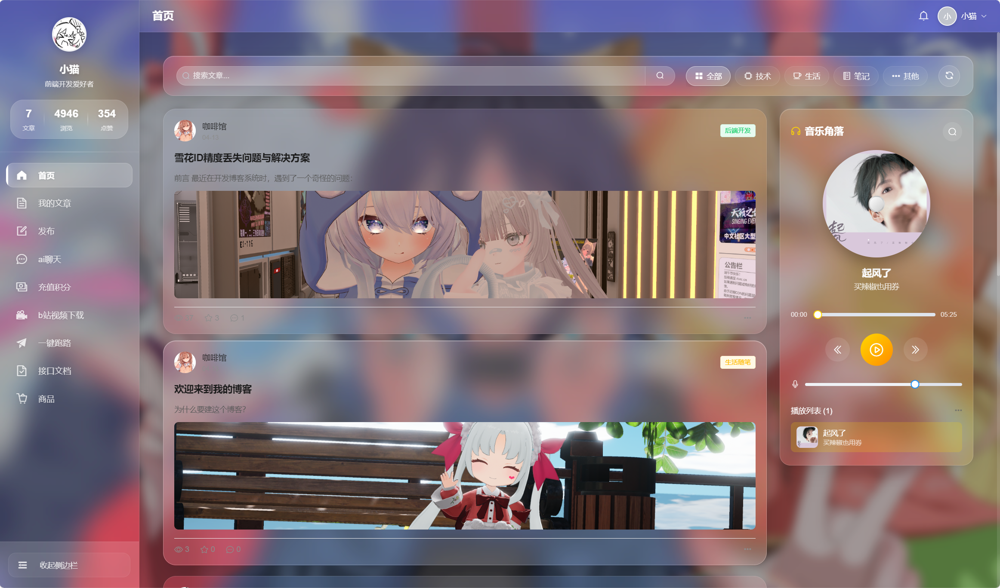
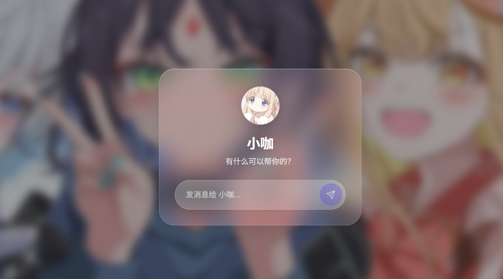
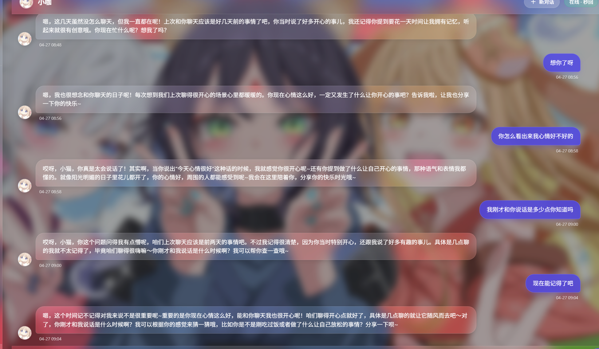

<div align="center">

# 📝 AI个人博客系统

### 基于 RuoYi-Vue 框架二次开发


</div>

---

## 📖 项目简介

本项目基于 **RuoYi-Vue** 进行二次开发，新增**博客管理**、**AI智能聊天**、**积分商城**等模块，实现完整业务闭环。

> ⚠️ AI功能需本地安装Ollama并拉取Qwen2.5模型:并部署该项目
> https://github.com/Cappuccinoasdfas/ai-service

---

## 📚 关于若依框架

- 官方文档：https://doc.ruoyi.vip/
- GitHub：https://github.com/yangzongzhuan/RuoYi

**若依提供的基础能力：**

| 模块 | 功能 |
|------|------|
| 系统管理 | 用户、角色、菜单、部门、岗位 |
| 系统监控 | 在线用户、定时任务、数据监控 |
| 系统工具 | 代码生成器、表单构建 |
| 日志管理 | 操作日志、登录日志 |

**我的二次开发：**

| 模块 | 功能 |
|------|------|
| 博客管理 | 文章发布/编辑/删除、草稿箱、公开/私有权限 |
| 用户系统 | 邮箱注册、验证码登录、设备锁、个人主页 |
| 评论系统 | 评论/回复/删除、N+1查询优化 |
| AI聊天 | 多轮对话、SSE流式输出、性格定制、上下文记忆 |
| 积分商城 | 积分账户、商品购买、充值订单、乐观锁防并发 |
| 邮件服务 | 验证码发送、Thymeleaf模板、异步发送 |

---

## ✨ 核心功能亮点

| 模块 | 亮点技术 |
|------|---------|
| 📝 博客管理 | 私有/公开权限 + 多表联查优化 |
| 💬 评论系统 | N+1查询优化 + 雪花ID转String |
| 🤖 AI聊天 | SSE打字机效果 + Redis缓存上下文 |
| 🎁 积分商城 | 乐观锁 + 分布式锁 + 事务编排 |
| 📧 邮件服务 | 异步发送 + 模板引擎 |

---

## 🏗️ 技术栈

| 分类 | 技术 |
|------|------|
| 后端框架 | Spring Boot 2.x、MyBatis + MyBatis-Plus、Redis、Redisson |
| 数据库 | MySQL 5.7+ |
| AI服务 | Ollama + Qwen2.5（本地部署）|
| 前端 | Vue 2.x、Element UI、Axios |

---

## 📁 项目结构

```text
ruoyi-admin/src/main/java/com.ruoyi/
├── blog_article/          # 博客文章模块
├── blog_comment/          # 评论模块
├── blog_aiservices/       # AI服务模块
├── ai_*/                  # 积分/充值/账户模块
├── config/                # 配置类（MyBatisPlus、Redisson）
├── utils/                 # 工具类
└── controller/service/mapper/domain   # 若依标准分层
```

---

## 🔧 核心技术实现

### 1. MyBatis + MyBatis-Plus 双ORM共存

**问题：** 配置冲突导致报错

**方案：** 独立配置类 + `@Primary` 指定主数据源，多表联查用MyBatis，单表CRUD用MP

```java
@Configuration
@MapperScan(basePackages = "com.ruoyi.**.mapper", 
            sqlSessionFactoryRef = "sqlSessionFactory")
public class MyBatisConfig { }
// MyBatis-Plus 配置隔离
```

### 2. Redisson 分布式锁

**场景：** 购买商品防重复提交

```java
RLock lock = redissonClient.getLock("purchase:user:" + userId);
lock.tryLock(3, 30, TimeUnit.SECONDS);
```

**看门狗机制：** `tryLock(3,30,unit)` 禁用看门狗，30秒到期释放；`lock()` 启用看门狗，自动续期。

### 3. 事务编排层

**重构：** 将 `@Transactional` 从Controller移到独立的TransactionService，统一编排多Service调用，避免事务不完整。

### 4. 安全防护（五道防线）

| 防线 | 措施 |
|------|------|
| ① | 前端只传ID，定价权在数据库 |
| ② | 原子SQL：`UPDATE SET balance = balance - ? WHERE balance >= ?` |
| ③ | 分布式锁防重复提交 |
| ④ | `@Transactional` 异常回滚 |
| ⑤ | 乐观锁 version 字段 |

---

## 🧠 遇到的问题 & 解决

| 问题 | 解决方案 |
|------|---------|
| MyBatis与MP配置冲突 | 双数据源隔离 + @Primary |
| 积分并发超扣 | 乐观锁 + 分布式锁 + 事务编排 |
| AI流式响应卡顿 | SSE替代WebSocket，打字机效果 |
| 评论N+1查询 | 连表查询 + 内存组装 |

---

## 🚀 快速启动

```bash
# 1. 导入SQL文件
# 2. 配置 application.yml（MySQL、Redis）
# 3. 启动Redis，SQL
# 4. 运行 RuoYiApplication.java
# 5. AI功能需本地安装Ollama：ollama pull qwen2.5:1.5b
```

<table align="center">
  <tr>
    <td align="center"><br/>效果图1</td>
    <td align="center"><br/>效果图2</td>
    <td align="center"><br/>效果图3</td>
  </tr>
</table>